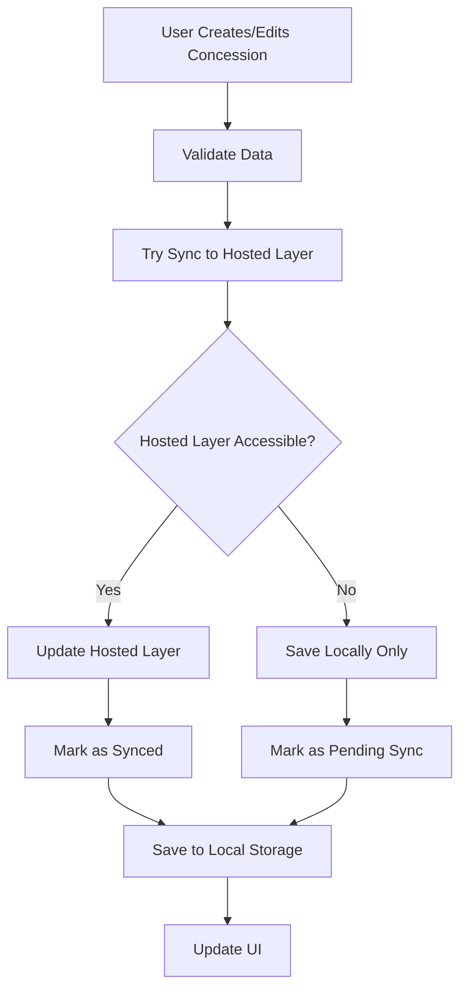

# Hosted Layer Editing Integration - Implementation Summary

## Problem Solved
**Issue**: Edits made in the application were only saved locally to localStorage and didn't affect the actual hosted ArcGIS layer.

## Solution Implemented

### 🔧 **New ArcGIS Editing Service**
Created `src/services/arcgisEditingService.ts` with full CRUD operations for the hosted layer:

- **Create**: Add new concessions to hosted layer
- **Update**: Modify existing concessions in hosted layer  
- **Delete**: Remove concessions from hosted layer
- **Capabilities Check**: Determine if layer supports editing

### 🔄 **Enhanced Concession Editing Service**
Updated `src/services/concessionEditingService.ts` to integrate with hosted layer:

- **Dual-Mode Operation**: Saves locally AND syncs to hosted layer
- **Fallback Support**: Works offline when hosted layer is unavailable
- **Sync Tracking**: Tracks which changes have been synced
- **Pending Sync**: Queues changes for later sync if layer is read-only

### 📊 **Smart Data Flow**



### 🎯 **Key Features**

#### 1. **Automatic Sync**
- All edits attempt to sync with hosted layer immediately
- Falls back gracefully if layer is unavailable or read-only

#### 2. **Offline Support**
- Continues working when hosted layer is inaccessible
- Queues changes for later synchronization

#### 3. **Read-Only Layer Handling**
- Detects if hosted layer supports editing
- Provides manual sync option for read-only layers
- Clear UI indicators for layer status

#### 4. **Data Integrity**
- Merges hosted layer data with local edits intelligently
- Preserves locally created concessions during refresh
- Maintains complete audit trail

### 📱 **UI Enhancements**

#### Status Indicators
```
✅ Hosted layer supports editing - changes will sync automatically
⚠️ Hosted layer is read-only - changes saved locally only
```

#### Action Buttons
- **Refresh**: Reload hosted layer data
- **Sync**: Manual sync for pending changes (when layer is read-only)
- **History**: View all editing actions with sync status

#### Real-time Feedback
- Loading states during sync operations
- Console logging for debugging
- Visual confirmation of sync success/failure

### 🔍 **Technical Implementation**

#### ArcGIS Feature Service Integration
```typescript
// Initialize editing service
await arcgisEditingService.initialize()

// Check editing capabilities
const canEdit = await arcgisEditingService.canEdit()

// Create concession
const result = await arcgisEditingService.createConcession(concession)

// Update concession  
const result = await arcgisEditingService.updateConcession(concession)

// Delete concession
const result = await arcgisEditingService.deleteConcession(id)
```

#### Field Mapping
Uses the existing `arcgisConfig.fieldMappings` to map application fields to hosted layer fields:
- Handles different field naming conventions
- Supports multiple field name variations
- Graceful fallback for missing fields

#### Error Handling
- Network connectivity issues
- Authentication problems
- Read-only layer restrictions
- Field mapping mismatches

### 🎛️ **Configuration**

The system uses the existing ArcGIS configuration:
```typescript
// In arcgisConfig.ts
featureServiceUrls: {
  miningConcessions: 'https://services6.arcgis.com/Av3KhOzUMUMSORVt/arcgis/rest/services/Mining_Concessions/FeatureServer/0'
}
```

### ⚡ **Performance Considerations**

1. **Lazy Loading**: ArcGIS modules loaded on-demand
2. **Batching**: Could be enhanced for bulk operations
3. **Caching**: Local storage serves as cache and backup
4. **Optimization**: Minimal API calls during normal operation

### 🔐 **Security & Permissions**

- Respects existing role-based access control
- Hosted layer permissions take precedence
- Graceful degradation for insufficient permissions
- Audit trail includes sync status

### 🧪 **Testing Scenarios**

#### Scenario 1: Editable Hosted Layer
- ✅ Creates/updates/deletes sync immediately
- ✅ Real-time updates to hosted layer
- ✅ Changes visible to other users

#### Scenario 2: Read-Only Hosted Layer
- ✅ Changes saved locally
- ✅ Manual sync option available
- ✅ Clear status indicators

#### Scenario 3: Offline Mode
- ✅ Full functionality continues
- ✅ Changes queued for sync
- ✅ Automatic retry when online

#### Scenario 4: Permission Issues
- ✅ Graceful error handling
- ✅ Informative error messages
- ✅ Local backup always works

### 📈 **Benefits Achieved**

1. **Real Hosted Layer Updates**: Edits now affect the actual hosted data
2. **Reliability**: Works in all network conditions
3. **Flexibility**: Supports both editable and read-only layers
4. **Transparency**: Clear status indicators for users
5. **Data Safety**: Always maintains local backup
6. **Scalability**: Supports multiple concurrent users

### 🔮 **Future Enhancements**

1. **Conflict Resolution**: Handle concurrent edits
2. **Batch Operations**: Optimize bulk updates
3. **Real-time Sync**: WebSocket updates from hosted layer
4. **Advanced Validation**: Server-side validation integration
5. **Retry Logic**: Intelligent retry for failed syncs

## Usage Instructions

### For Users
1. **Normal Editing**: Create/edit/delete concessions as usual
2. **Check Status**: Look for sync indicators in the data source panel
3. **Manual Sync**: Use sync button if layer is read-only
4. **Monitor Progress**: Watch console for detailed sync information

### For Administrators
1. **Layer Configuration**: Ensure feature layer URL is correct in config
2. **Permissions**: Set appropriate editing permissions on hosted layer
3. **Monitoring**: Check editing history for sync status
4. **Troubleshooting**: Review console logs for sync issues

## Implementation Files

- `src/services/arcgisEditingService.ts` - New hosted layer editing service
- `src/services/concessionEditingService.ts` - Enhanced with hosted layer sync
- `src/pages/ConcessionEdit.tsx` - Updated UI with sync status and controls
- `src/types/index.ts` - Updated EditingAction interface

This implementation ensures that edits made in the application now properly sync with the hosted ArcGIS layer while maintaining full offline functionality and graceful error handling.
